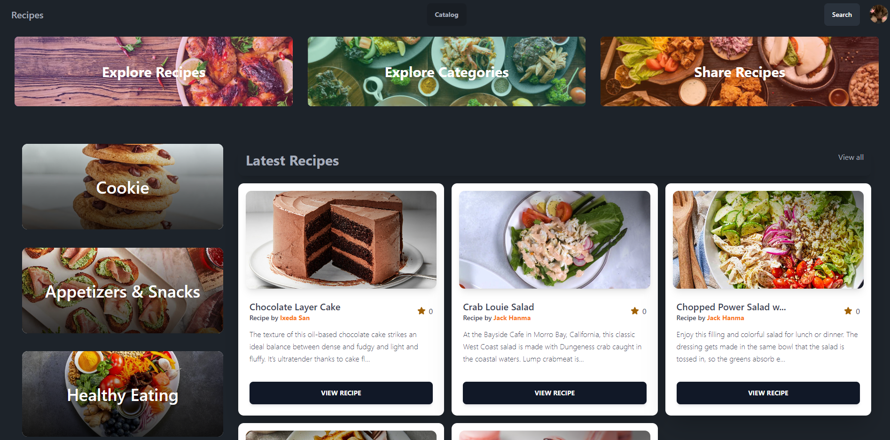

# Django Recipe Management Web Application

## Description
This is a Django web application that allows users to search for and share recipes with others. Users can create accounts, upload their own recipes, leave comments on recipes, and favorite recipes they like. The project utilizes the Tailwind CSS utility-first framework for styling.

## Features

### Anonymous User
- Register a new account
- Log in to an existing account
- View all recipes
- Search recipes by cuisine
- View comments on recipes

### Authenticated User
- Add/remove recipes from favorites
- Leave comments on recipes
- Create new recipes
- Delete their own recipes
- Edit their own recipes

### Administrator
- View all models (users, recipes, comments)
- Edit all models
- Change user passwords

## Technologies Used
- Front-end: Django Templates, Tailwind CSS
- Back-end: Django (Python)
- Database: SQLite

## Getting Started

### Installation
1. Clone the repository:
   - `git clone https://github.com/ixedasan/recipe-management.git`
   - `cd recipe-management`
2. Create a virtual environment and activate it:
   - `python -m venv .venv`
   - `.venv\Scripts\activate`
3. Install Python dependencies:
   - `pip install -r requirements.txt`
4. Create a `.env` file in the root directory and add the following environment variables:
5. Install Python dependencies:
   - `python manage.py migrate`
6. Run the development server:
   - `python manage.py runserver`
   - The application should now be running at `http://localhost:8000`.

## Contributing
Contributions are welcome! If you find any issues or have suggestions for improvements, please open an issue or submit a pull request.
